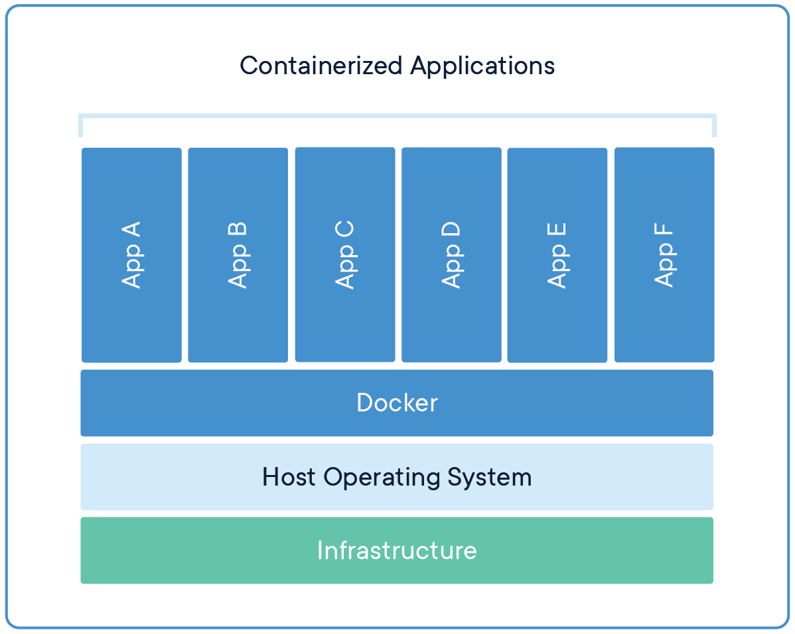
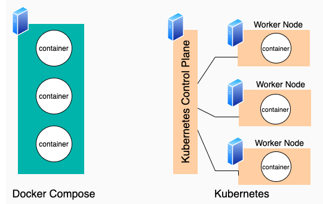

<i>Bản thân Linux chỉ là một Kernel, nó không phải là một hệ điều hành hoàn chỉnh. Hệ điều hành mà các bạn có thể vẫn đang sử dụng thực tế trên máy tính của mình có tên là GNU/Linux, nhưng có lẽ vì cái tên nó dài dòng nên người ta đã gọi ngắn gọn nó là Linux chăng. Việc lược bỏ đi GNU trong tên gọi hệ điều hành được cho là không công bằng, và đánh giá thấp vai trò của GNU. Tuy nhiên, biết sao được, nhiều người vẫn dùng cái tên Linux để thay cho tên gọi hệ điều hành GNU/Linux. Và khi nhắc đến Hệ Điều Hành Linux, ta cần hiểu đó là Hệ Điều Hành GNU/Linux. Trong series này tôi cũng sẽ sử dụng cách gọi đó, hệ điều hành Linux.
Hệ điều hành Linux hoàn toàn không sử dụng chung, hay kế thừa bất kỳ phần code nào của Unix, hay BSD. Nó được xây dựng mới hoàn toàn bởi Linus và GNU Project để có thể trở thành … một phiên bản clone của Unix. Chính vì thế Linux và các hệ điều hành con cháu của Unix hiện nay (như MacOS chẳng hạn) có rất nhiều điểm giống nhau.</i>

Unix là một hệ điều hành vốn ra đời đã từ rất lâu, tại phòng thí nghiệm Bell Labs của AT&T. Dự án được dẫn dắt bởi Ken Thompson và Dennis Ritchie, 2 nhà khoa học máy tính nổi tiếng.
 

Những năm sau của thập niên 70, AT&T chia sẻ Unix cho những tổ chức giáo dục, hay tổ chức thương mại bên ngoài, từ đó dẫn đến sự ra đời của nhiều phiên bản Unix khác nhau. Nổi bật nhất trong số đó là phiên bản giáo dục được xây dựng bởi Computer Systems Research Group thuộc đại học California, Berkeley. Phiên bản này được biết đến rộng rãi với cái tên Berkeley Software Distribution, hay BSD.
 

Phiên bản thương mại, close source nổi tiếng, thành công nhất, có lẽ chính là MacOS đình đám của Apple. MacOS cũng như các hệ điều hành khác của Apple hiện nay là iOS, watchOS, và tvOS đều được dựa trên nền tảng của BSD. Và MacOS cũng là một trong số ít các hệ điều hành được coi là Unix-like, khi có được chứng nhận Single UNIX Specification. Chúng ta sẽ còn nói rõ hơn về khái niệm Unix-like ở phần cuối của bài viết này.
 

Mục tiêu của dự án GNU là tạo ra được một hệ điều hành miễn phí, giống Unix, nơi mà mọi người có quyền tự do copy, phát triển, chỉnh sửa và phân phối phần mềm, và việc tái phân phối là không bị giới hạn. (Nên nhớ, Unix và các phiên bản rẽ nhánh từ Unix ban đầu đều là close source và bị ràng buộc bản quyền)
GNU Project đã đạt được nhiều thành tựu lớn, tạo ra được nhiều công cụ tương tự như những gì có trên Unix. Tuy nhiên, GNU vẫn thiếu một thành phần quan trọng, mảnh ghép cuối cùng để nó trở thành một hệ điều hành hoàn chỉnh. Đó chính là Kernel, phần thực hiện công việc điều khiển, giao tiếp với các thiết bị phần cứng (CPU, RAM, Devices …).
 

Sự kết hợp giữa nhân Linux, với các phần mềm của GNU đã tạo ra một hệ điều hành hoàn chỉnh, hệ điều hành hoàn toàn miễn phí đầu tiên. Nó được mang tên GNU/Linux.
 

<i>Ubuntu là một hệ điều hành máy tính dựa trên Debian GNU/Linux, một bản phân phối Linux thông dụng. Tên của nó bắt nguồn từ "ubuntu" trong tiếng Zulu, có nghĩa là "tình người", mô tả triết lý ubuntu: "Tôi được là chính mình nhờ có những người xung quanh," một khía cạnh tích cực của cộng đồng.</i>
 
<i>

Bản "Alpine Linux" là một bản phân phối Linux dựa trên musl và BusyBox, được phát triển chú trọng về đơn giản, bảo mật và hiệu quả tài nguyên. Bởi vì kích thước khá nhỏ của nó nên được dùng nhiều cho Container để cung cấp thời gian khởi động nhanh.</i>

 
VNC Server là gì?

VNC Server (Virtual Network Computing Server) là một hệ thống dùng để chia sẻ màn hình máy tính cho người dùng khác từ xa.

Công nghệ VNC Server sử dụng giao thức TCP và cổng 5900 trở lên. Nó hoạt động bằng cách ghi nhận nội dung framebuffer và chia sẻ chúng với VNC Client.

VNC hoạt động theo cơ chế Client/Server và sử dụng giao thức VNC để chia sẻ màn hình. VNC Server ghi nhận dữ liệu framebuffer (các thông tin về hình ảnh) của máy tính và chia sẻ chúng với VNC Client. 

Khi client kết nối tới server, VNC server sẽ chia sẻ hình ảnh màn hình của máy tính với client thông qua kết nối mạng. Client sẽ tạo ra một bản tái hiện của màn hình máy tính trên màn hình của nó, và cho phép người dùng tương tác và điều khiển máy tính từ xa thông qua các hoạt động như bấm các phím, di chuyển chuột và thực hiện các thao tác khác.

